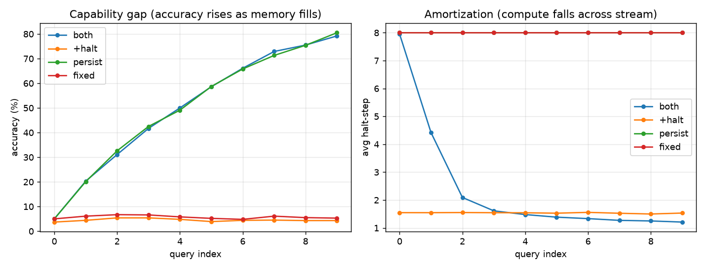

# Results

## Hidden-rule pilot ✅ (first positive evidence)

Task: `data_rule.py` / `model_rule.py` / `ablation_rule.py` — a hidden permutation
π over [n] with **partial observation across a query stream**. Each query reveals
only a few (x, π(x)) pairs; the probe x* is never among the current query's keys,
so it is answerable **only from memory accumulated in prior queries**. This forces
cross-query weight adaptation and creates a real capability gap.

Setup: n=20, m=3 pairs/query, Q=10 queries/episode, T=8 latent steps, ~0.22M params,
3000 steps, CPU. Four configs with **per-config halting threshold** (fair):
`fixed` (reset, no halt), `+halt` (reset, halt), `persist` (persist, no halt),
`both` (persist + halt = AWE).

### Numbers

| config | accuracy | avg steps | accuracy across stream (q0…q9) |
|---|---|---|---|
| fixed   |  5.7% | 8.0 | 5 6 7 7 6 5 5 6 5 5 — flat (chance) |
| +halt   |  4.5% | 1.5 | flat (chance) |
| persist | 50.1% | 8.0 | 5 20 33 43 49 59 66 71 75 81 — **rises** |
| both    | 50.0% | 2.4 | 5 20 31 42 50 59 66 73 75 79 — **rises** |

### Three AWE claims, all supported

1. **Capability gap** — persistent memory drives accuracy 5% → 81% across the
   stream; memory-reset configs stay at chance (5%). Weight adaptation is *necessary*.
2. **Amortization (H1)** — `both`'s compute falls **q0 = 7.95 → q9 = 1.21** steps:
   as memory fills, later queries halt almost immediately.
3. **Surprise = memory-miss** — `corr(answerable, surprise@step0) = −0.963`.
   The single surprise signal cleanly detects whether the probe is already in memory,
   and that same signal drives halting.

Net: `both` matches `persist` accuracy (50%) at **2.4 vs 8.0 steps** (3.3× less
compute), and the saving *grows* along the stream. This is exactly
*"surprise detects a memory miss; as memory accumulates, depth shrinks."*

## Reachability (negative baseline)

The original full-table functional-graph reachability
(`data.py`/`model_ttt.py`/`ablation_amort.py`) is retained as a **negative result**:
because the whole graph is in every query's context (memory redundant) and random
graphs admit no shortcut, all configs hit 100% and the amortization curve is flat.
It documents *why* the task must supply reusable structure + a capability gap — the
motivation for the hidden-rule design above.
