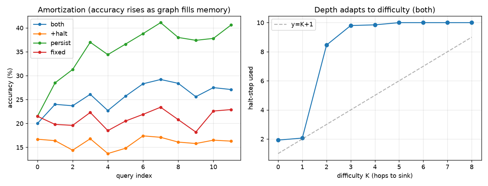

# Results

## Main claim (calibrated)

> A **single surprise signal** can reliably drive **each** of the two axes of
> test-time compute allocation — **adaptive depth (halting)** and **fast-weight
> memory update** — and shows **initial directional evidence** when the two are
> combined in one task.

We do **not** claim to have jointly-optimally controlled both at once; the joint
setting is still base-task-limited (Part 3). The evidence is a three-part chain:

| # | claim | task | key number |
|---|---|---|---|
| 1 | depth halting tracks difficulty | in-context reachability | `corr(K, halt) = +0.92` |
| 2 | surprise = memory-miss; memory update buys compute | hidden-rule (partial obs) | `corr(miss) = −0.96`, 5%→81%, 2.4 vs 8 steps |
| 3 | joint (depth + memory) | partial-obs reachability | directional (22%→41%), undertrained |

---

## Part 1 — Depth-only proof (`train_eval.py`, `model.py`)

In-context functional-graph reachability (whole graph given each query). The
recurrent-depth reasoner's **halting tracks difficulty**: accuracy rises with
test-time depth (r=1 → 64%, r≥6 → 100%) and **`corr(K, steps-to-converge) ≈
+0.92`** — convergence (reaching the sink fixed-point) is a clean surprise-driven
halting signal. Memory is redundant here (graph fully in context), so this
isolates the **depth knob**.

## Part 2 — Memory-only proof (`data_rule.py`, `model_rule.py`, `ablation_rule.py`)

Hidden permutation π with **partial observation across a query stream** — the
probe is answerable only from memory accumulated in prior queries. This isolates
the **weight knob** and is the strongest result:

| config | accuracy | avg steps | accuracy across stream |
|---|---|---|---|
| fixed / +halt (reset) | ~5% | — | flat (chance) |
| persist | 50.1% | 8.0 | **5 → 81%** |
| both (persist+halt) | 50.0% | **2.4** | 5 → 79% |

- **Capability gap**: persistence drives 5% → 81%; reset stays at chance → weight
  adaptation is *necessary*.
- **Amortization**: `both` compute falls **7.95 → 1.21** steps across the stream.
- **Surprise = memory-miss**: `corr(answerable, surprise) = −0.96`.
- Net: same accuracy as `persist` at **2.4 vs 8.0** steps (3.3× less compute),
  and the saving grows along the stream.

## Part 3 — Joint stress-test (`data_reachp.py`, `ablation_reachp.py`)

Partial-observation reachability tries to combine both knobs: a functional graph
(varying depth K, convergence-halting) revealed only partially and accumulated in
memory. Honest outcome — **directional, not clean**:

- Amortization present but modest: persist accuracy **22% → 41%** across the
  stream; overall accuracy low (~35%).
- Depth *increases* with K but crudely: halt-step ≈ 2 for K≤1, then **saturates
  at the budget (10) for K≥2** — a step function, not clean `halt ≈ K+1`.
- `corr(answerable, surprise) = −0.23` (much weaker than Part 2's −0.96).

**Why**: the bottleneck is the base learner, not the AWE mechanism — a 0.22M model
(CPU, 4k steps) cannot learn to *chain-follow a graph accumulated in memory* for
long chains (loss plateaus ~2.27; K≥2 chains fail → halting just hits the budget).
Next: K-curriculum + auxiliary next-node loss + easier config + more capacity
(see roadmap).

## Negative baseline (retained)

Full-table reachability (`ablation_amort.py`): the whole graph in every query's
context makes memory redundant and random graphs admit no shortcut, so all configs
hit 100% and the amortization curve is flat. Documents *why* the task must supply
reusable structure + a capability gap — the motivation for Parts 2–3.
