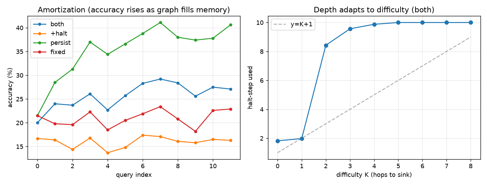

# Results

## Main claim (updated 2026-07-06, post bake-off)

> Each test-time axis works when driven by *a* suitable signal, and the
> **halting-signal bake-off (Part 4, two independent runs × 5 seeds) settles
> which signal**: on the joint task, **convergence-family signals (readout
> convergence / Δstate) make halting free** (accuracy at the persist ceiling
> at 60–86% of the compute), while **entropy and reconstruction-error
> thresholds fail as halting rules** (lose accuracy or refuse to halt).
> On the memory-only task, recon ≈ entropy — "TTT loss as a free halting
> signal" survives there. Surviving thesis form: **state convergence = the
> memory-loss gradient vanishing (Δs ∝ ∇L)** — one quantity, two readings
> (halt when it vanishes; write in proportion to it).

The evidence chain:

| # | claim | task | key number | status |
|---|---|---|---|---|
| 1 | depth halting tracks difficulty | in-context reachability | `corr(K, halt) = +0.92` | ✅ |
| 2 | memory buys accuracy + compute | hidden-rule (partial obs) | persist 5%→81% (10 seeds: 50.5±0.4%); both 2.42±0.10 vs 8.0 steps | ✅ |
| 3 | joint (depth + memory) | partial-obs reachability | entropy-halting costs −9.5pp (10 seeds: 35.1±0.7 vs 25.6±0.4) — reinterpreted in Part 4 | 🔴 with entropy |
| 4 | **which signal halts correctly** | bake-off, weak+strong learners | conv 71.9±0.3% @ 5.18 steps = persist ceiling; ent/recon lose | ✅ convergence family |

**Cross-cutting caveats** (updated): headline rows now carry 10-seed mean±std
(seeds 0–9 for rule/reachp ablations and bakeoff; seeds 0–4 for reachp3);
held-out tau calibration is in effect for all bake-off numbers (archived
pre-fix logs retained); "compute" = latent retrieval steps only (delta-rule
write FLOPs are unaffected by halting); models are 0.2–0.9M params on
synthetic tasks — mechanism pilots, not LLM-scale evidence.

---

## Part 1 — Depth-only proof (`experiments/depth_sanity.py`, `models/recurrent.py`)

In-context functional-graph reachability (whole graph given each query). The
recurrent-depth reasoner's **halting tracks difficulty**: accuracy rises with
test-time depth (r=1 → 64%, r≥6 → 100%) and **`corr(K, steps-to-converge) ≈
+0.92`**.

**What the halting signal actually is here**: steps-to-prediction-stability
(first step after which the argmax prediction never changes), computed in
hindsight over the full rollout — i.e. *convergence to the sink fixed-point*,
not a surprise/reconstruction scalar, and not an online rule. It isolates the
**depth knob** and shows the task has the right difficulty structure; it does
not yet test surprise-driven halting. Memory is redundant here (graph fully in
context). *Provenance caveat: single seed; the run log was not archived —
regeneration is queued.*

## Part 2 — Memory-only proof (`datasets/rule.py`, `models/memory.py`, `experiments/ablation_rule.py`)

Hidden permutation π with **partial observation across a query stream** — the
probe is answerable only from memory accumulated in prior queries. This isolates
the **weight knob** and is the strongest result:

| config | accuracy | avg latent steps | accuracy across stream |
|---|---|---|---|
| fixed / +halt (reset) | ~5% | — | flat (chance) |
| persist | 50.1% | 8.0 | **5% → 81%** |
| both (persist+halt) | 50.0% | **2.4** | 5% → 79% |

- **Capability gap**: persistence drives 5% → 81%; reset stays at chance → memory
  across the stream is *necessary*. (Note this is partly by construction — the
  task is designed so only cross-query memory can answer — so it validates the
  harness and the retention/retrieval plumbing rather than being an independent
  discovery.)
- **Amortization**: `both` latent steps fall **7.95 → 1.21** across the stream.
- **Halting signal = readout entropy, not the write signal.** The write is
  gated by the delta-rule reconstruction error; halting thresholds the entropy
  of the answer readout. `corr(answerable, entropy@step0) = −0.96` shows the
  readout is well calibrated (confident exactly when the answer is in memory) —
  a useful sanity check, but *not* evidence for the shared-reconstruction-error
  thesis, which remains untested on this task.
- Net: same accuracy as `persist` at **2.4 vs 8.0 latent steps** (≈3.3× fewer
  *retrieval* steps; write cost is unchanged by halting — FLOPs accounting
  including writes pending).

## Part 3 — Joint stress-test (`datasets/reachp.py`, `experiments/ablation_reachp.py`)

Partial-observation reachability tries to combine both knobs: a functional graph
(varying depth K, convergence-halting) revealed only partially and accumulated in
memory. Honest outcome — **negative for joint control; memory-only amortization
holds** (`results/reachp_run.log`):

| config | accuracy | avg steps | across stream |
|---|---|---|---|
| fixed | 21.0% | 10.0 | flat |
| +halt | 16.0% | 3.2 | flat |
| persist | **35.3%** | 10.0 | 22% → 41% |
| both (AWE) | 25.7% | 5.4 | 20% → 27% |

- **Turning halting ON costs accuracy**: `both` 25.7% vs `persist` 35.3%
  (−9.6pp), and `+halt` 16.0% vs `fixed` 21.0% (−5pp). Since `both` halts early
  (5.4 < 10 steps) yet loses to the identical model without halting, a
  substantial fraction of halts are *confident-but-wrong / premature* — the
  entropy scalar reads "low, stop" on examples where more depth over the
  still-filling memory would have converted errors into hits (persist's 22→41
  vs both's 20→27 shows the foregone gains). **Resolved in Part 4**: the cost
  is substantially a median-tau calibration artifact plus a signal-choice
  error — convergence-family halting removes it.
- Depth *increases* with K but as a step function: halt-step ≈ 2 for K≤1, then
  **jumps toward the budget for K≥2** (8.4 at K=2, 9.6–9.9 for K=3–4, pinned at
  10 for K≥5). The parsimonious reading: the base
  learner cannot resolve K≥2 chains (loss plateaus ~2.27), entropy never falls,
  and the halting signal correctly reports "not done" — i.e. saturation itself
  is not a signal failure, but there is no evidence of *graded* depth either.
- **Labeling artifact found and fixed (2026-07-06)**: `ans` counted only
  strictly-prior reveals while the model writes the *current* query's edges
  before retrieving, so probes solvable from current-query reveals were labeled
  unanswerable (with legitimately low surprise). Re-run with identical seed
  (`results/reachp_run_v2.log`; training/accuracies reproduce exactly, only
  `ans`-dependent statistics change): **corr moves −0.229 → −0.293**. The
  artifact therefore explains only a small part of the weak coupling — even
  with correct labels, entropy tracks answerability far more weakly here than
  on hidden-rule (−0.96), which is a real property of the joint task, not a
  measurement error. (The `fixed` baseline of 21% vs 1/24 ≈ 4% chance remains
  explained by within-query-solvable probes + ~3/24 sink probes + sink priors.)

**Diagnosis (revised)**: three confounded causes, not one — (a) base-learner
limits on chain-following over accumulated memory, (b) the measurement artifact
above, and (c) a genuine halting-rule failure for multi-hop (confident-wrong
early exits). The earlier "not a mechanism failure" wording was unsupported;
(c) *is* a mechanism problem for entropy-threshold halting. Next steps: the
halting-signal bake-off + per-example failure decomposition (early-wrong /
early-right / never-confident), K-curriculum + aux next-node loss + capacity
(`ablation_reachp2`) so learner and controller failures separate.

*(Figure regenerated after the labeling fix; the pre-fix artifacts
`reachp_curve.png` / `reachp_run.log` are retained for provenance.)*

## Part 4 — Halting-signal bake-off (`experiments/bakeoff.py`, `experiments/ablation_reachp3.py`)

Two independent implementations, both 5 seeds, held-out tau, with
shuffled-steps nulls / fixed-depth frontiers / per-halt failure decomposition:

**(a) Weak-learner tasks** (`bakeoff.py`, seeds 0–9, original rule & reachp):

| task | signal | acc | steps | verdict |
|---|---|---|---|---|
| rule | ent | 50.1±0.7% | 2.22 | works |
| rule | **recon** | 50.1±0.5% | 2.38 | **≈ ent → free-signal thesis holds on memory task** |
| rule | dstate | 50.3±0.6% | **1.90** | best |
| reachp | ent | 34.7±0.6% | 9.71 | refuses to halt (safe but useless) |
| reachp | recon | 31.7±0.6% | 8.39 | −3.4pp, tau fallback |
| reachp | **dstate** | 33.8±0.6% | **6.28** | **only useful operating point** (−1.3pp at 63% compute, premature ~3%) |

**(b) Strong-learner task** (`ablation_reachp3.py`, seeds 0–4, reachp2 config
where persist = 71.9%):

- **conv (readout convergence): 71.9±0.3% @ 5.18 steps — halting is free**
  (matches the persist ceiling, early-wrong 2%).
- dstate: also at ceiling (5.91 steps).
- entropy and recon: **−5.7pp** (early-wrong 8–9%) — confirmed losers.

**Verdicts.**
1. Part 3's "halting costs −9.6pp" is **substantially a tau-calibration
   artifact**: median-tau forced aggressive halting; with slack-based held-out
   tau, entropy doesn't *hurt* — it simply provides no compute-saving operating
   point on the joint task. The signal-choice error was the bottleneck, not
   halting per se.
2. The literal thesis signal (reconstruction-error threshold) is **refuted as
   a halting rule on joint tasks** (both learners, 10 seeds total) but
   **survives on the memory-only task** (matches entropy at matched compute,
   with zero trained machinery).
3. The **convergence family wins everywhere** — consistent with Part 1's +0.92
   and with the theory-side prediction that Geiping-convergence and
   Titans-surprise unify only where the latent step approximates gradient
   descent on the memory loss (then Δs ∝ ∇L, and "surprise gradient vanished"
   = "state converged"). Making that identity architectural (latent step = GD
   on the memory loss) is the constructive next step; kill criterion NOT
   triggered — the thesis pivots from "low surprise → halt" to "surprise
   stopped moving the state → halt".

## Negative baseline (retained)

Full-table reachability (`experiments/ablation_amort.py`): the whole graph in
every query's context makes memory redundant and random graphs admit no
shortcut, so all configs hit 100% and the amortization curve is flat. Documents
*why* the task must supply reusable structure + a capability gap — the
motivation for Parts 2–3. *Caveat: this script calibrates one `tau` (from the
ttt-on surprise distribution) and applies it to all configs, which is unfair to
`+halt` (different surprise scale — it can fail to ever cross `tau`); later
scripts use per-config tau. The negative verdict stands for task-structure
reasons, but the flat `+halt` curve is partly a tau-scale artifact.*

## Signal inventory (added 2026-07-06 — read this before quoting "surprise")

Different experiments use different scalars; the docs previously blurred them:

| experiment | write gate | halting signal |
|---|---|---|
| Part 1 `depth_sanity` | — (no memory) | prediction-stability (hindsight convergence) |
| `ablation_ttt` / `ablation_amort` | recon error (shared) | recon error (shared) — **the actual thesis; inconclusive/negative tasks** |
| Part 2 `ablation_rule` | recon error | **readout entropy** |
| Part 3 `ablation_reachp` | recon error | **readout entropy** |

The configuration the project's headline describes — one reconstruction-error
scalar driving both knobs on a task with a real capability gap — **has not yet
been run**. That is the top roadmap item (see `PROJECT.md` §7).
