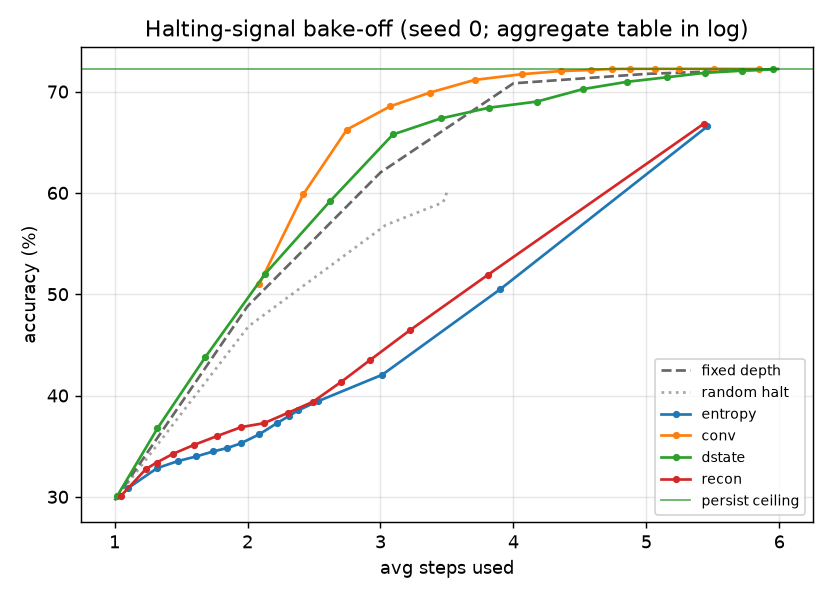

# Results

## Main claim (recalibrated 2026-07-06, after the 10-seed halting-signal bake-off)

> Each test-time axis works when driven by *a* suitable signal — depth halting by
> prediction/state **convergence** (Parts 1, 3-B), an error-gated fast-weight
> memory by delta-rule writes (Part 2). The 10-seed bake-off (Part 3-B) shows the
> earlier "joint halting costs accuracy" was **not inevitable for every stopping
> rule**: entropy- and reconstruction-error halting cost −5.6pp (confident-wrong
> early exits, early-wrong 8–9%), but convergence signals preserve accuracy
> (`conv`, `dstate` at −0.0pp vs the persist ceiling 72.0±0.6%). **Caveat**:
> `dstate` preserves accuracy mostly by *declining to halt* (conservative,
> 5.93/6 steps); the only signal that also saves compute is `conv` (5.0 steps),
> a readout statistic with no write-side role.
>
> **Honest bottom line**: depth-halting and memory-writing want **different
> observables** (convergence for depth; reconstruction-miss for the write). The
> reconstruction scalar — the literal "one surprise" thesis — is a **halting
> loser** here (with the tested definition + held-out `tau`), so a *single* scalar
> driving both is not supported. A *weak* unification — both are gradients of one
> memory loss (∇_s L for depth, ∇_W L for the write) — is a consistent but
> near-trivial *interpretation*; it becomes a finding only if the halt signal is
> shown to predict the write magnitude (untested — the MQAR probe,
> `docs/mqar_design.md`). See §"Part 3-B".

The evidence is a three-part chain:

| # | claim | task | key number | status |
|---|---|---|---|---|
| 1 | depth halting tracks difficulty | in-context reachability | `corr(K, halt) = +0.92` | ✅ |
| 2 | memory buys accuracy + compute | hidden-rule (partial obs) | persist 5%→81%; both 2.4 vs 8.0 latent steps; `corr(ans, entropy) = −0.96` | ✅ |
| 3 | joint, *entropy* halt (historical) | partial-obs reachability | entropy halting costs accuracy | 🟡 superseded by 3-B |
| 3-B | joint halting is **accuracy-preserving** with a convergence signal (conv also saves compute; dstate conservative) | partial-obs reachability, **10-seed** bake-off | conv/dstate −0.0pp vs persist 72.0±0.6%; entropy/recon −5.6pp | ✅ |

**Cross-cutting caveats**: "compute" = latent retrieval steps only (delta-rule
write FLOPs are unaffected by halting); models are 0.2–0.9M params on synthetic
tasks — these are *mechanism* pilots, not LLM-scale evidence. Provenance now
differs by part: **Parts 1–2 remain single-seed** with `tau` calibrated on the
scored batch. The **Part 3 bake-off (3-B) is 10 seeds with held-out-batch `tau`**
— this is where the review's variance + test-set-leakage concern is actually
addressed. **reachp2 is also 10 seeds**, but its persist/amortization headline
uses *no halting* (so `tau` is not involved at all); its `+halt`/`both` configs
still calibrate median `tau` on the scored batch (leakage there is *not* yet
fixed). Parts 1–2 leakage also pending.

---

## Part 1 — Depth-only proof (`experiments/depth_sanity.py`, `models/recurrent.py`)

In-context functional-graph reachability (whole graph given each query). The
recurrent-depth reasoner's **halting tracks difficulty**: accuracy rises with
test-time depth (r=1 → 64%, r≥6 → 100%) and **`corr(K, steps-to-converge) ≈
+0.92`**.

**What the halting signal actually is here**: steps-to-prediction-stability
(first step after which the argmax prediction never changes), computed in
hindsight over the full rollout — i.e. *convergence to the sink fixed-point*,
not a surprise/reconstruction scalar, and not an online rule. It isolates the
**depth knob** and shows the task has the right difficulty structure; it does
not yet test surprise-driven halting. Memory is redundant here (graph fully in
context). *Provenance caveat: single seed; the run log was not archived —
regeneration is queued.*

## Part 2 — Memory-only proof (`datasets/rule.py`, `models/memory.py`, `experiments/ablation_rule.py`)

Hidden permutation π with **partial observation across a query stream** — the
probe is answerable only from memory accumulated in prior queries. This isolates
the **weight knob** and is the strongest result:

| config | accuracy | avg latent steps | accuracy across stream |
|---|---|---|---|
| fixed / +halt (reset) | ~5% | — | flat (chance) |
| persist | 50.1% | 8.0 | **5% → 81%** |
| both (persist+halt) | 50.0% | **2.4** | 5% → 79% |

- **Capability gap**: persistence drives 5% → 81%; reset stays at chance → memory
  across the stream is *necessary*. (Note this is partly by construction — the
  task is designed so only cross-query memory can answer — so it validates the
  harness and the retention/retrieval plumbing rather than being an independent
  discovery.)
- **Amortization**: `both` latent steps fall **7.95 → 1.21** across the stream.
- **Halting signal = readout entropy, not the write signal.** The write is
  gated by the delta-rule reconstruction error; halting thresholds the entropy
  of the answer readout. `corr(answerable, entropy@step0) = −0.96` shows the
  readout is well calibrated (confident exactly when the answer is in memory) —
  a useful sanity check, but *not* evidence for the shared-reconstruction-error
  thesis, which remains untested on this task.
- Net: same accuracy as `persist` at **2.4 vs 8.0 latent steps** (≈3.3× fewer
  *retrieval* steps; write cost is unchanged by halting — FLOPs accounting
  including writes pending).

## Part 3 — Joint stress-test (`datasets/reachp.py`, `experiments/ablation_reachp.py`)

Partial-observation reachability tries to combine both knobs: a functional graph
(varying depth K, convergence-halting) revealed only partially and accumulated in
memory. Honest outcome — **negative for joint control; memory-only amortization
holds** (`results/reachp_run.log`):

| config | accuracy | avg steps | across stream |
|---|---|---|---|
| fixed | 21.0% | 10.0 | flat |
| +halt | 16.0% | 3.2 | flat |
| persist | **35.3%** | 10.0 | 22% → 41% |
| both (AWE) | 25.7% | 5.4 | 20% → 27% |

- **Turning halting ON costs accuracy**: `both` 25.7% vs `persist` 35.3%
  (−9.6pp), and `+halt` 16.0% vs `fixed` 21.0% (−5pp). Since `both` halts early
  (5.4 < 10 steps) yet loses to the identical model without halting, a
  substantial fraction of halts are *confident-but-wrong / premature* — the
  entropy scalar reads "low, stop" on examples where more depth over the
  still-filling memory would have converted errors into hits (persist's 22→41
  vs both's 20→27 shows the foregone gains). *(Historical: this was the central
  open problem at the time; Part 3-B below resolves it — the cost is specific to
  the entropy/recon signals, not the mechanism.)*
- Depth *increases* with K but as a step function: halt-step ≈ 2 for K≤1, then
  **jumps toward the budget for K≥2** (8.4 at K=2, 9.6–9.9 for K=3–4, pinned at
  10 for K≥5). The parsimonious reading: the base
  learner cannot resolve K≥2 chains (loss plateaus ~2.27), entropy never falls,
  and the halting signal correctly reports "not done" — i.e. saturation itself
  is not a signal failure, but there is no evidence of *graded* depth either.
- **Labeling artifact found and fixed (2026-07-06)**: `ans` counted only
  strictly-prior reveals while the model writes the *current* query's edges
  before retrieving, so probes solvable from current-query reveals were labeled
  unanswerable (with legitimately low surprise). Re-run with identical seed
  (`results/reachp_run_v2.log`; training/accuracies reproduce exactly, only
  `ans`-dependent statistics change): **corr moves −0.229 → −0.293**. The
  artifact therefore explains only a small part of the weak coupling — even
  with correct labels, entropy tracks answerability far more weakly here than
  on hidden-rule (−0.96), which is a real property of the joint task, not a
  measurement error. (The `fixed` baseline of 21% vs 1/24 ≈ 4% chance remains
  explained by within-query-solvable probes + ~3/24 sink probes + sink priors.)

**Diagnosis (revised, then resolved by 3-B)**: three confounded causes, not one —
(a) base-learner limits on chain-following over accumulated memory, (b) the
measurement artifact above, and (c) a halting-rule failure for multi-hop
(confident-wrong early exits). `ablation_reachp2` (curriculum + aux + d=256, 10
seeds) fixes (a) — persist rises to **72.1±0.6%** (reset 43.3% → persist 72.1%) —
which isolates (c). The bake-off (**Part 3-B**) then shows (c) is a **signal
*choice*** problem, not a mechanism failure: entropy/recon halt confident-wrong,
but convergence signals do not.

*(Figure regenerated after the labeling fix; the pre-fix artifacts
`reachp_curve.png` / `reachp_run.log` are retained for provenance.)*

## Part 3-B — Halting-signal bake-off (`experiments/ablation_reachp3.py`, 10 seeds)

Same joint task, same trained base learner (curriculum + aux, d=256); races four
halting signals on **identical trajectories** with **per-arm `tau` calibrated on a
held-out batch**, plus fixed-depth / random-halt baselines and a per-example
failure decomposition. 10 seeds. Persist ceiling (fixed depth T=6) **72.0±0.6%**.
(This is the same quantity as reachp2's persist **72.1±0.6%** — full depth, no
halt — measured by a different script on an independent eval draw; the 0.1pp is
sampling noise.)

| halt signal | acc | avg steps | gap vs persist | early-wrong | corr(ans, sig₀) |
|---|---|---|---|---|---|
| `dstate` = ‖Δsₜ‖²/d | **72.0±0.6%** | 5.93±0.06 | **−0.0pp** | **1.1%** | +0.05 |
| `conv` = sym-KL(pₜ, pₜ₋₁) | 71.9±0.6% | 5.00±0.58 † | **−0.0pp** | 3.6% | +0.14 |
| `entropy` (status quo) | 66.4±0.9% | 5.44 | −5.6pp | 8.5% | −0.45 |
| `recon` = ‖n(sₜ₊₁)−n(rₜ)‖² | 66.3±0.7% | 5.39 | −5.6pp | 8.8% | −0.25 |

† conv's step count is **bimodal across seeds** (std 0.58 vs dstate's 0.07): on
**7/10** seeds it genuinely saves compute (~4.6 steps, ~46% correct early exits);
on **3/10** — where the accuracy-optimal `tau` lands on a near-flat curve — it
collapses to dstate-like conservatism (~5.9 steps, ~5% early-right, i.e. no
saving). **Accuracy (−0.0pp) is robust across all 10 seeds; the compute *saving*
is not.** (corr(ans, sig₀) for conv is measured at step 1 — no finite step 0.)

**Read carefully — the result is real but narrow:**

- **The −5.6pp halting cost is signal-specific.** `entropy` and `recon` halt
  aggressively but *miscalibrated*: ~9% of examples exit early-and-wrong (their
  signal reads "confident, stop" on still-unresolved multi-hop probes; negative
  `corr(ans)` confirms the signal anti-tracks answerability). This — not the
  mechanism — is what cost accuracy in Part 3.
- **Convergence-family signals remove it.** Both `conv` and `dstate` match the
  persist ceiling (−0.0pp). But they do so differently, and only *sometimes*
  cheaply: **`conv` saves compute on most seeds** — it halts early *and correctly*
  (mean early-right 34%), reaching the ceiling in ~4.6 steps on **7/10** seeds —
  but this is **bimodal** (see † : on 3/10 seeds `conv` collapses to dstate-like
  conservatism, no saving). **`dstate` is the *safe* one** — early-wrong just 1.1%
  — but **conservative**: its accuracy-optimal `tau` almost never halts before the
  budget (5.93/6 steps), so it matches persist largely by *declining to halt*
  rather than by saving compute.
- **Implication for the thesis.** `dstate = ‖Δs‖²` is the signal the unification
  story points to (‖Δs‖ ≈ η‖∇_s L_mem‖ near the step's fixed point), and it
  preserves accuracy — but *conservatively* (5.93/6 steps, early-right ~3%): it
  mostly declines to halt, so "cost-free" here means **accuracy-preserving, not
  compute-saving**. The strong claim ("one scalar drives both knobs *optimally*")
  does **not** hold: the compute-efficient halter (`conv`) is a readout statistic
  with no write role, and the literal thesis scalar (`recon`) *loses* at halting
  (with this definition + held-out `tau`). The recon miss-detector is right for
  gating *writes*, wrong for gating *depth* — i.e. the two knobs want **different
  observables**. The "two gradients of one memory loss" reading (§ main claim) is
  a cautious interpretation, not established here; whether `dstate` predicts the
  write magnitude is the open probe (`docs/mqar_design.md`).

## Negative baseline (retained)

Full-table reachability (`experiments/ablation_amort.py`): the whole graph in
every query's context makes memory redundant and random graphs admit no
shortcut, so all configs hit 100% and the amortization curve is flat. Documents
*why* the task must supply reusable structure + a capability gap — the
motivation for Parts 2–3. *Caveat: this script calibrates one `tau` (from the
ttt-on surprise distribution) and applies it to all configs, which is unfair to
`+halt` (different surprise scale — it can fail to ever cross `tau`); later
scripts use per-config tau. The negative verdict stands for task-structure
reasons, but the flat `+halt` curve is partly a tau-scale artifact.*

## Signal inventory (2026-07-06; updated after the bake-off — read before quoting "surprise")

Different experiments use different scalars; the docs previously blurred them:

| experiment | write gate | halting signal |
|---|---|---|
| Part 1 `depth_sanity` | — (no memory) | prediction-stability (hindsight convergence) |
| `ablation_ttt` / `ablation_amort` | recon error (shared) | recon error (shared) — the literal thesis; inconclusive/negative tasks |
| Part 2 `ablation_rule` | recon error | readout entropy |
| Part 3 `ablation_reachp` | recon error | readout entropy |
| **Part 3-B `ablation_reachp3`** | recon error (write unchanged) | **bake-off: entropy / conv / dstate / recon**, held-out tau |

**Verdict on the literal "one reconstruction-error scalar" thesis**: now tested
(the `recon` arm of Part 3-B) and it **loses at halting** (−5.6pp, early-wrong
9%). A single scalar drives halting cost-free only if it is a *convergence*
signal (`conv` / `dstate`); the write-relevant one (`dstate` ≈ ‖∇_s L‖) is the
*safe* member, not the compute-efficient one. See §"Part 3-B" and `PROJECT.md` §4.
